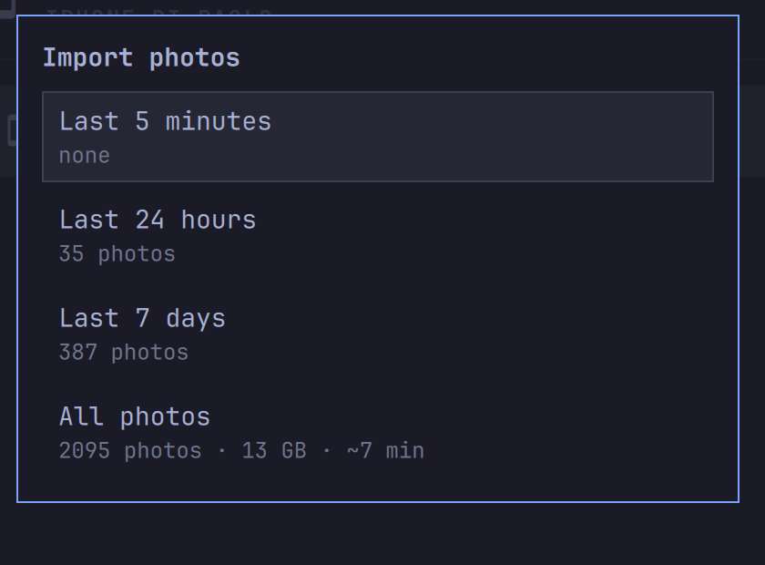

# iPhone

Your iPhone on the Omarchy bar. Plug it in over USB and you get its battery
at a glance and your camera roll one click away — browse it in your file
manager, or import new photos to a folder on your computer. No jailbreak, no
app on the phone.


## What it does

- **Battery in the bar.** Once your iPhone is paired, its charge shows next
  to the bar icon — glance and go.
- **One-click setup.** The first time, the panel offers to install the two
  system pieces it needs (`usbmuxd`, `ifuse`) and start them, behind a single
  password prompt. Nothing to configure by hand.
- **Guided pairing.** Plug in, press **Pair**, and the panel walks you
  through it — "Unlock the iPhone and tap Trust", "Enter the passcode" — in
  plain words, never a cryptic error.
- **Open the camera roll.** One click mounts the phone and opens its photos
  (`DCIM`) in your file manager, which already knows how to show HEIC. Eject
  from the same row when you're done.
- **Import photos, your way.** Clicking import asks how far back to reach —
  the last 5 minutes, 24 hours, 7 days, or everything — and for **All photos**
  it shows the size and rough time before you commit. It copies only what
  isn't already there, so your folder stays safe to reorganize.



When an import finishes, a desktop notification tells you how many photos
synced, how long it took, and where they landed — click it to open the
folder.

## First time: three steps

1. **Add the widget** (see Install), open its panel, and plug your iPhone in
   with a USB cable.
2. If the panel shows a **Set up iPhone support** button, click it once and
   enter your password — it installs and starts what's needed.
3. Press **Pair**, then on the iPhone tap **Trust** and enter your passcode.
   That's it — battery appears in the bar and the photo buttons light up.

Pairing is a one-time thing; after that, plugging in just works.

## Requirements

| Dependency | Needed for | Notes |
|---|---|---|
| `libimobiledevice` | talking to the iPhone | Usually already installed. |
| `usbmuxd` | the USB connection | The panel installs and starts it for you. |
| `ifuse` | opening the camera roll | The panel installs it for you. |
| `rsync` | importing photos | Present on most systems. |
| `xdg-open` | opening folders | Present on any desktop. |

## Install

```bash
omarchy plugin add https://github.com/dicemans/omarchy-plugin-iphone.git --enable
```

The widget lands in the bar's right section. Move it with:

```bash
omarchy bar move io.github.dicemans.iphone --section left
```

## Removal

```bash
omarchy plugin remove io.github.dicemans.iphone
```

That deletes the plugin and drops its entry from your shell config. It leaves
your imported photos exactly where they are, and it never touched your
containers, contacts, or anything on the phone. The two packages it offered
to install (`usbmuxd`, `ifuse`) stay unless you remove them yourself with
`sudo pacman -Rns usbmuxd ifuse`.

## Keyboard & shortcuts

With the panel focused: **arrows** move, **Enter** activates (or presses the
setup button), **p** opens photos on the selected device, **r** refreshes,
**Esc** closes. In the import menu, up/down pick a window and Enter starts it.

Every action is scriptable, so you can bind it to a key:

```bash
omarchy-shell io.github.dicemans.iphone toggle
omarchy-shell io.github.dicemans.iphone openPhotos   # first paired device
```

## Settings

Through **Setup → Plugins**, or on the widget's entry in
`~/.config/omarchy/shell.json`:

| Setting | Default | Meaning |
|---|---|---|
| Refresh interval | `15` s | How often battery refreshes while the panel is open. |
| Show battery in the bar | on | Paint the phone's charge next to the bar icon. |
| Only show this device | — | With several iPhones, list only the one whose UDID contains this text. |
| Import photos into | `~/Pictures/iPhone` | Where "Import photos" copies the camera roll. |

## Why USB only

An iPhone doesn't let a Linux computer read its data over WiFi or Bluetooth
the way a Mac does — Apple keeps that for its own devices. WiFi shows only
presence (and only while the phone is awake), and Bluetooth won't hand a
computer your contacts. Rather than ship buttons that disappoint, this plugin
sticks to the cable, which does the useful things reliably, first try.

## Privacy & security

- The phone is mounted in a temporary, per-user location that's wiped when
  you log out and is never readable by other users.
- The only thing that ever asks for your password is the one-time setup
  (installing the two packages); its tooltip says exactly what it will do
  before you click. Browsing and importing photos need no elevation.
- Your photos are only ever copied where you choose; nothing is uploaded
  anywhere.

## Troubleshooting

`bin/iphone-ctl` is a plain script — run it in a terminal to see what's going
on:

```bash
~/.config/omarchy/plugins/io.github.dicemans.iphone/bin/iphone-ctl deps
~/.config/omarchy/plugins/io.github.dicemans.iphone/bin/iphone-ctl status
```

## License

MIT — see [LICENSE](LICENSE).
