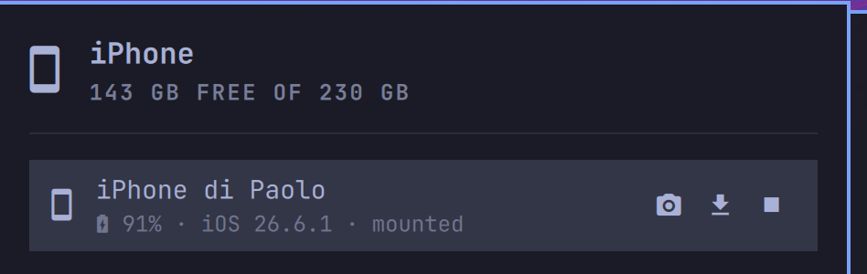

# iPhone

Your iPhone on the Omarchy bar: presence and battery at a glance, guided
pairing — trust dialog included — and your camera roll one click away in the
file manager or copied to a folder. Over the USB cable, no jailbreak, no app
on the phone.



## What it does

- **Detects your iPhone over USB** and shows it in the bar; battery
  percentage next to the glyph once paired.
- **One-click setup**: missing system pieces (`usbmuxd`, `ifuse`) are
  installed from the official repos and activated behind a **single** polkit
  authorization — the already-plugged phone is picked up without re-plugging
  the cable.
- **Guided pairing**: every stop of the pairing conversation is a state with
  its own next step, never a bare error — "Unlock the iPhone and tap Trust",
  "Enter the passcode", "Trust was declined — ask again".
- **Open camera roll**: mounts the phone user-space (`ifuse`, no root) and
  opens `DCIM` in your file manager, which already knows how to thumbnail
  HEIC. Eject from the same row.
- **Import new photos**: one click copies the camera roll into a folder of
  your choice (`~/Pictures/iPhone` by default) — only what is not already
  there, so the folder stays safe to reorganize. It runs in passes and
  heals a dropped connection on the way, and it tells you when some items
  live only in iCloud and could not be copied.

## Why USB only

An iPhone deliberately does not let a generic Linux computer read its data
over WiFi or Bluetooth the way a Mac does: WiFi presence needs the phone
awake and carries no data on the stock stack, and Bluetooth PBAP (contacts,
call history) is refused to anything that is not a car kit. Both were tried
and dropped rather than shipped as buttons that disappoint. The cable does
the things that actually work well, first try.

## Requirements

| Dependency | Needed for | Notes |
|---|---|---|
| `libimobiledevice` | everything | Usually already installed. |
| `usbmuxd` | talking to the phone | The panel offers to install and start it. |
| `ifuse` | mounting the camera roll | The panel offers to install it. |
| `rsync` | importing photos | Present on most systems. |
| `xdg-open` | opening DCIM | Present on any desktop. |

## Install

```bash
omarchy plugin add https://github.com/dicemans/omarchy-plugin-iphone.git --enable
```

## Keyboard and IPC

Arrows move, `Enter` activates (or presses the setup button while setup is
needed), `p` opens photos on the selected device, `r` refreshes, `Esc`
closes. Scriptable:

```bash
omarchy-shell io.github.dicemans.iphone toggle
omarchy-shell io.github.dicemans.iphone openPhotos   # first paired device
```

## Settings

Set these on the widget's entry in `~/.config/omarchy/shell.json`, or through
Setup → Plugins.

| Key | Default | Meaning |
|-----|---------|---------|
| `refreshIntervalSec` | `15` | How often the device list and battery refresh while the panel is open. Kept high: each poll briefly wakes the phone. |
| `showBattery` | `true` | Paint the phone's battery percentage next to the bar glyph. |
| `preferredUdid` | `""` | With several iPhones around, list only the one whose UDID contains this text. |
| `importFolder` | `~/Pictures/iPhone` | Where "Import new photos" copies the camera roll. |

## Privacy & security

- Mounts live under `$XDG_RUNTIME_DIR` (tmpfs): gone at logout, never
  world-readable.
- The only privileged path is the setup button — package install plus
  usbmuxd activation, one pkexec, declared in the tooltip before you click.
  Mounting itself is user-space FUSE and needs no elevation.
- Device identifiers are validated before they ever reach a command line.

## Layout

```
manifest.json      plugin manifest (bar-widget, settings schema)
Panel.qml          bar button + panel (thin renderer)
Model.js           parsing and per-state action rules, no QML types
bin/iphone-ctl     every libimobiledevice call, mount, and launch
```

`bin/iphone-ctl` is a plain script and the place to look when something
misbehaves — run it in a terminal:

```bash
~/.config/omarchy/plugins/io.github.dicemans.iphone/bin/iphone-ctl deps
~/.config/omarchy/plugins/io.github.dicemans.iphone/bin/iphone-ctl status
```

## License

MIT — see [LICENSE](LICENSE).
